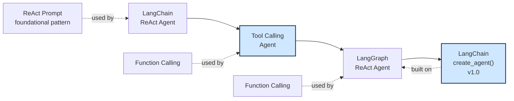

# The Evolution of LangChain Agents

A recap of how LangChain's own agent-building approach changed over time, and where the code in this repo sits in that history.

## The lifecycle, left to right

**Beginning phase.** Everything starts from the raw **ReAct prompt** pattern, text-based reasoning, `Thought / Action / Action Input / Observation`, exactly what was built by hand, with regex parsing and a scratchpad, in the agents-under-the-hood branch earlier in this course. The earliest LangChain ReAct Agent was built directly on top of this plain-text pattern, no structured tool calling existed yet.

**Middle phase.** Once model providers added native **function calling**, structured, API-level tool requests instead of free text, LangChain moved to a **Tool Calling Agent**, no more regex parsing required, the model's intent to call a tool became a real, structured field in the response, exactly the shift demonstrated directly, side by side, in the agents-under-the-hood branch's file 1 versus file 3.

**Later phase.** The **LangGraph ReAct Agent** is the version built in this repo, the reasoning-and-acting loop, still powered by function calling, but now expressed as an explicit graph of nodes and edges, `StateGraph`, `MessagesState`, `ToolNode`, `add_conditional_edges`, rather than a single opaque agent object managing its own hidden loop internally.

**Current phase, v1.0.** `create_agent()`, the function used throughout the search-agent and agents-under-the-hood branches, is the newest, most convenient layer, and it is explicitly built on top of a LangGraph ReAct agent underneath. This is the same relationship already understood conceptually from the three-layer diagram in agents-under-the-hood, `create_agent` is Layer 0, the full abstraction, and this repo's hand-built `StateGraph` is one level further down than that, showing the actual graph `create_agent` constructs for you behind the scenes.

## Legacy AgentExecutor versus LangGraph, confirmed against current docs

| Legacy `AgentExecutor` | LangGraph |
|---|---|
| Hidden control flow, the loop runs inside the executor, invisible to you | Explicit graph structure, every node and edge is something you wrote and can see |
| Configuration via loose keyword arguments | Typed state schemas, `MessagesState` or a custom `TypedDict`, the shape of your data is explicit and checkable |
| Persistence was DIY, you built your own memory or session handling | Built-in checkpointing, `MemorySaver` and similar, state can be saved and resumed across runs with a few lines, not a custom system |
| Limited streaming, generally only final output, sometimes token streaming with extra plumbing | Native token-level and node-level streaming, you can observe exactly which node is running and what it's producing live |
| Built around a single agent making decisions | Native multi-agent workflows, a graph's nodes can themselves be entire other agents or sub-graphs, this is explicitly where LangGraph's design advantages become decisive over the legacy executor, not just a nice-to-have |

**Why this matters, tied directly to what's already been built.** The  branch already demonstrated, by hand, exactly why hidden control flow is limiting, writing that raw `for` loop was the only way to actually see each iteration, each tool call, each decision point. LangGraph takes that same hand-built loop and gives it first-class support, explicit nodes instead of a raw `for` loop, a typed state object instead of a growing list you manage yourself, and a conditional-edge function, `should_continue` in this repo, instead of an `if not tool_calls: break` buried inside the loop body. It is, structurally, the same ReAct loop every version of this course has built, from the raw regex-parsed scratchpad all the way to this graph, just with progressively more of the bookkeeping handled by the framework instead of by hand.

## The one-sentence 

**LangChain agents started as plain-text ReAct prompting, moved to structured function calling once models supported it, then moved again to LangGraph, which turns that same reasoning loop into an explicit, typed, resumable graph, and `create_agent()` is simply the newest, friendliest wrapper around exactly that LangGraph-based ReAct agent.**