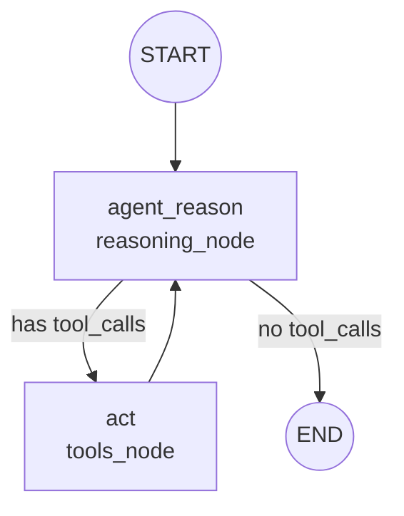

# LangGraph Course

A from-scratch rebuild of a LangGraph lesson, a ReAct agent built as an explicit state graph instead of a hidden agent loop, with real tool calling against Tavily search and a custom tool.

See `EVOLUTION.md` in this repo for how this specific architecture fits into the broader history of how LangChain agents have been built over time.

## What it does

Given the question "What is the temperature in Egypt-Mansoura? List it and then triple it," the agent searches the web for the current temperature, then calls a custom `triple` tool on the result, looping between reasoning and tool execution until it has everything it needs to answer.

## Architecture



This is the actual graph the code builds and compiles, the same shape `app.get_graph().draw_mermaid_png()` renders to `flow.png`. Two nodes, one conditional branch, one loop-back edge.

## Files

### `react.py`, tools and model setup

```python
@tool
def triple(num: float) -> float:
    """
    param num: a number to triple
    returns: the triple of the input number
    """
    return float(num) * 3
```
A custom tool, same `@tool` decorator pattern from every earlier branch, the docstring is what the model reads to decide when to call it.

```python
tools = [TavilySearch(max_results=1), triple]
llm = ChatGoogleGenerativeAI(model="gemini-3.6-flash")
```
`TavilySearch(max_results=1)` caps how many search results come back per call, keeping the tool's output small and focused rather than returning a large result set the model has to sift through. `tools` and `llm` are both module-level objects here, created once and imported by `nodes.py`, not recreated per request.

### `nodes.py`, the two things that actually run inside the graph

```python
def reasoning_node(state: MessagesState) -> MessagesState:
    response = llm.invoke([{"role": "system", "content": SYSTEM_MESSAGE}] + state["messages"])
    return {"messages": [response]}
```
A **node** in LangGraph is just a plain function that takes the current state and returns an update to merge into it. `MessagesState` is a prebuilt state shape whose `messages` field automatically appends new messages to the existing list, rather than replacing it, that's why `reasoning_node` only needs to return the *one new* response message, LangGraph's built-in reducer for `messages` handles appending it to the running history for you.

```python
tools_node = ToolNode(tools)
```
`ToolNode` is a prebuilt LangGraph component, you hand it your tool list and it becomes a ready-to-use node, it reads the most recent AI message's `tool_calls`, executes each one, and returns the results as `ToolMessage` objects, you did not have to write this loop by hand, unlike the raw agent-loop branch earlier in the course.

### `main.py`, wiring the graph together

```python
REASON_AGENT = "agent_reason"
ACT = "act"
LAST = -1
```
Named constants for the two node names, used consistently below instead of repeating string literals, a small but genuinely good habit, a typo in a bare string node name fails silently or with a confusing error, a typo in a constant name fails immediately and loudly.

```python
def should_continue(state: MessagesState) -> str:
    if not state["messages"][LAST].tool_calls:
        return END
    return ACT
```
This is the **conditional edge function**, called after `reasoning_node` runs, on every single pass through the loop. It looks at the most recent message, `state["messages"][LAST]`, and checks whether the model asked for any tool calls. No tool calls means the model is done reasoning and ready to answer, route to `END`. Tool calls present means more work is needed, route to `ACT`.

```python
flow = StateGraph(MessagesState)
flow.set_entry_point(REASON_AGENT)
flow.add_node(REASON_AGENT, reasoning_node)
flow.add_node(ACT, tools_node)
```
`StateGraph(MessagesState)` creates a graph whose state shape is `MessagesState`, every node receives and returns pieces of that same shared state. `set_entry_point` says where execution starts, `add_node` registers each function under the name that `should_continue` and the edges below reference.

```python
flow.add_conditional_edges(REASON_AGENT, should_continue, {
    END: END,
    ACT: ACT})
flow.add_edge(ACT, REASON_AGENT)
```
`add_conditional_edges` wires `should_continue`'s return value to an actual next node, after `REASON_AGENT` runs, call `should_continue`, then go wherever it says. `add_edge(ACT, REASON_AGENT)` is the fixed, unconditional edge that always sends control back to reasoning after any tool executes, this is the actual loop, drawn directly in the Architecture diagram above.

```python
app = flow.compile()
```
Turns the graph definition into something runnable. Nothing above this line actually executes anything, `compile()` is the step that makes `app.invoke(...)` possible.

## Trace of a real run

Question asked: *What is the temperature in Egypt-Mansoura? List it and then triple it*

1. **Reason** → model decides it needs current data, calls `tavily_search` with the query "current temperature in Mansoura Egypt."
2. **Act** → Tavily returns a result page, but it's a generic timezone page, not actually containing a usable temperature.
3. **Reason** → model notices the first result wasn't useful, calls `tavily_search` again with a more specific query, "weather current temperature Mansoura Egypt Celsius."
4. **Act** → this time Tavily returns a real weather API result, `temp_c: 26.5`, `temp_f: 79.8`.
5. **Reason** → model now has the temperature, calls `triple` with `26.5`.
6. **Act** → `triple` returns `79.5`.
7. **Reason** → model also triples the Fahrenheit value, calls `triple` with `79.8`.
8. **Act** → `triple` returns `239.39999999999998`.
9. **Reason** → no more tool calls, model writes the final answer, both values listed and tripled. `should_continue` sees no `tool_calls` on this message and routes to `END`.

**Worth noting as a real, observed behavior, not something written into the code deliberately.** The agent re-searched on its own after the first search returned an unhelpful page, nothing in `react.py` or `nodes.py` tells it to retry, this emerged from the model's own reasoning at the `reasoning_node` step, a concrete example of the dynamic decision-making that separates an agent from a fixed, scripted pipeline.

**Also worth noting**, the final answer's `response.content` again came back as the structured list of blocks, same recurring Gemini behavior seen throughout this course, `main.py`'s `msg.pretty_print()` happens to display it reasonably either way here since it's a debugging print, not a user-facing answer, but the same `isinstance` guard would be needed if this were feeding a UI.

## Setup

```bash
git clone https://github.com/Haneenmohammed1311/Langgraph-Course.git
cd Langgraph-Course
uv sync
```

`.env` needs:
GOOGLE_API_KEY=your_key_here
TAVILY_API_KEY=your_key_here

## Running it

```bash
uv run python main.py
```
