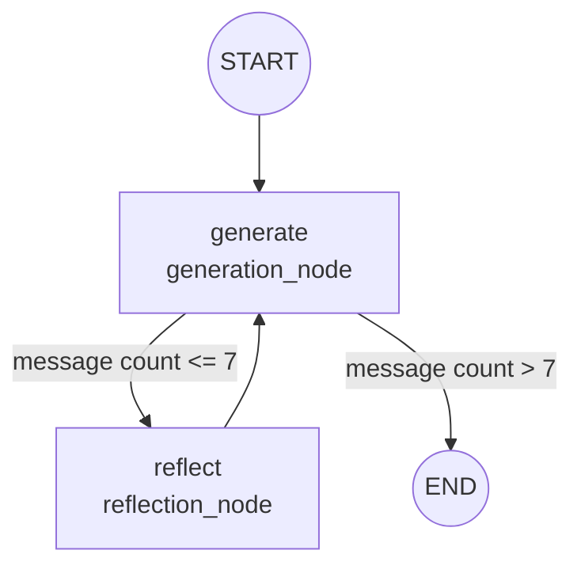

# Reflection Agent

A self-critiquing LangGraph agent for improving LinkedIn posts. One node writes or revises a draft, a second node critiques it, and the two loop back and forth until a message-count limit is reached.

## Before you run this

Open `main.py` and replace the placeholder below with the actual post you want improved.

```python
POST_TO_IMPROVE = """[PASTE YOUR POST HERE]"""
```

**[PASTE YOUR POST HERE] is a placeholder, not real input.** The graph will run against it exactly as written if left unedited, so make sure to replace it with your own content before invoking the graph.

## What it does



Two nodes, one loop. `generation_node` writes or revises a LinkedIn post draft, `reflection_node` critiques the most recent draft, and the critique feeds back into the next round of generation, repeating until `should_continue` cuts the loop off.

## Files

### `chains.py`, the two roles

```python
generation_prompt = ChatPromptTemplate.from_messages([
    ("system", "You are a top-tier LinkedIn content creator. Generate the best possible "
               "LinkedIn post based on the user's request. If the user provides critique, "
               "revise your previous post using that feedback to produce an improved version."),
    MessagesPlaceholder(variable_name="messages"),
])

reflection_prompt = ChatPromptTemplate.from_messages([
    ("system", "You are a top-tier LinkedIn thought leader and strict reviewer grading a LinkedIn post. "
               "Generate critical feedback and recommendations for the user's post. "
               "Always provide detailed recommendations, including requests for professional tone, "
               "formatting (bullet points, spacing), hooks, and engagement strategies."),
    MessagesPlaceholder(variable_name="messages"),
])

llm = ChatGoogleGenerativeAI(model="gemini-3.6-flash")
generate_chain = generation_prompt | llm
reflect_chain = reflection_prompt | llm
```

Two separate chains, same model, different system prompts, giving the same underlying LLM two distinct personas depending on which chain it's invoked through. `MessagesPlaceholder(variable_name="messages")` is where the actual running conversation gets inserted when the chain is invoked, everything the generator or reflector sees beyond its fixed system instructions.


### `main.py`, the graph

```python
class MessageGraph(TypedDict):
    messages: Annotated[list[BaseMessage], add_messages]
```
The state shape for this graph, a single `messages` list, `Annotated[..., add_messages]` tells LangGraph to append new messages to the existing list rather than replace it, same reducer pattern used in the ReAct branch's `MessagesState`, just defined by hand here instead of imported.

```python
def generation_node(state: MessageGraph):
    return {"messages": [generate_chain.invoke({"messages": state["messages"]})]}
```
Sends the entire current conversation to the generator and returns its response as the one new message to append.

```python
def reflection_node(state: MessageGraph):
    cls_map = {"human": AIMessage, "ai": HumanMessage}
    translated = [state["messages"][0]] + [
        cls_map[msg.type](content=msg.content) for msg in state["messages"][1:]
    ]
    response = reflect_chain.invoke({"messages": translated})
    return {"messages": [HumanMessage(content=response.content)]}
```
Before sending the conversation to the reflector, every message after the first gets its role flipped, human becomes AI, AI becomes human. From the reflector's point of view, a previous draft isn't something it said, it's content submitted for it to critique, so it's relabeled as a human turn, and any of the reflector's own past critiques are relabeled back to AI, since those genuinely were its own prior output.

**A real bug caught and fixed here too.** Without this role swap, `gemini-3.6-flash` raised `ValueError: Model 'gemini-3.6-flash' does not support model prefilling. The final request turn must be a user message or a function response.` Gemini refuses a request whose final message is an assistant turn, it treats that as being asked to continue speaking as itself rather than respond fresh. The swap both fixes that specific requirement and reflects the conceptually correct framing either way.

```python
def should_continue(state: MessageGraph):
    if len(state["messages"]) > 7:
        return END
    return REFLECT
```
The stopping condition, once the conversation has grown past 7 messages, roughly three full generate-reflect rounds, the loop ends regardless of whether the reflector would have kept critiquing.

```python
builder.add_conditional_edges(GENERATE, should_continue, path_map={END: END, REFLECT: REFLECT})
builder.add_edge(REFLECT, GENERATE)
```
Same conditional-edge pattern as the ReAct branch, `should_continue` runs after every `generate` step and decides the next node, `reflect` always routes straight back to `generate`, that fixed edge is the actual loop.

## Setup

```bash
git clone https://github.com/Haneenmohammed1311/Langgraph-Course.git
cd Langgraph-Course
git checkout reflection-agent
uv sync
```

`.env` needs:
- GOOGLE_API_KEY=your_key_here


## Running it

1. Open `main.py`, replace `POST_TO_IMPROVE`'s placeholder with your actual post.
2. ```bash
   uv run python main.py
3. The script writes graph.png, the compiled graph's structure, and prints the full response dictionary at the end, the final message in response["messages"] is the last generated draft.