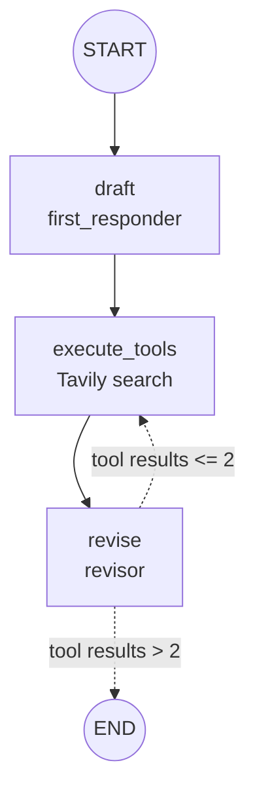

# Reflexion Agent

A LangGraph agent that drafts an answer, critiques its own draft, searches the web to fill the gaps it found, and revises with numbered citations. The search and revise rounds repeat until a fixed limit.

## Before you run this

Open `main.py` and replace the question you want researched.

```python
QUESTION = "[PASTE YOUR QUESTION HERE]"
```

**[PASTE YOUR QUESTION HERE] is a placeholder.** The graph runs exactly what is written in `QUESTION`, so edit it before running.

## Reflection versus Reflexion

| | reflection-agent branch | this branch(Reflexion Agent) |
|---|---|---|
| Who critiques | A second LLM persona reviews the draft | The same actor critiques its own answer |
| Outside information | None | Web search, with queries written by the model |
| Output shape | Free text | Structured: answer, reflection (missing and superfluous), search queries, references |
| Grounding | None | Numbered citations and a References list |
| Stop rule | Message count | Count of tool results |

The name comes from the Reflexion paper (Shinn et al., NeurIPS 2023), which reinforces language agents through verbal feedback instead of weight updates. This branch is a simplified adaptation in the style of the LangGraph tutorial: critique, search, cited revision. It has no episodic memory buffer across separate trials, which the paper's full framework does.

## Architecture



Dashed arrows are the conditional edge decided by `event_loop`.

## Files

### schemas.py, the structured output contract

```python
class Reflection(BaseModel):
    missing: str
    superfluous: str

class AnswerQuestion(BaseModel):
    answer: str
    reflection: Reflection
    search_queries: List[str]

class ReviseAnswer(AnswerQuestion):
    references: List[str]
```

These Pydantic classes double as the tool schemas given to the model. The class name becomes the function name, the docstring becomes its description, and each `Field(description=...)` becomes the documentation of an argument. The model never needs a real function here. "Calling" `AnswerQuestion` is just the way to force it to return its answer in this exact shape. `ReviseAnswer` inherits everything from `AnswerQuestion` and adds `references`.

### chains.py, the two model roles

- `actor_prompt_template` is one shared prompt with two blanks, `{time}` and `{first_instruction}`, followed by a `MessagesPlaceholder` for the conversation.
- `.partial(time=lambda: ...)` pre-fills `{time}` with a function. A callable is re-evaluated every time the prompt is formatted, so the model always sees the current time.
- `first_responder` fills `{first_instruction}` with "provide a detailed ~250 word answer" and binds only `AnswerQuestion` with `tool_choice="AnswerQuestion"`. That forces a structured tool call every time.
- `revisor` fills `{first_instruction}` with the revision rules (use the critique, add numerical citations, add a References section, stay under 250 words) and binds `ReviseAnswer` the same way.
- `parser_pydantic` (`PydanticToolsParser`) turns a tool call's arguments into an `AnswerQuestion` object. It is only used by the smoke test at the bottom of the file.

### tool_executor.py, running the searches

- `TavilySearch(max_results=5)` is the search tool.
- `run_queries(search_queries)` uses `.batch(...)` to run every query the model proposed in one call. It only needs `search_queries`. The `**kwargs` lets it accept the other fields in the call (answer, reflection, references) without error.
- `execute_tools = ToolNode([...])` registers `run_queries` twice, under the names `AnswerQuestion` and `ReviseAnswer`. When the model "calls" either structured-output tool, `ToolNode` finds a tool with that name and runs the searches. That naming is what connects the schema trick to a real action.

### main.py, the graph

- `draft_node` calls `first_responder` once and appends its message.
- `revise_node` calls `revisor` and appends its message.
- `event_loop` counts how many `ToolMessage` objects are in the state. It returns `END` when the count is greater than `MAX_ITERATIONS`, otherwise `"execute_tools"`.
- Edges: `START -> draft -> execute_tools -> revise`, then the conditional edge from `revise` goes back to `execute_tools` or to `END`.
- **`MAX_ITERATIONS = 2` gives three search rounds, not two.** The check is `>`, so the loop ends only when the count reaches 3. One run is 4 model calls (1 draft plus 3 revisions) and 3 search rounds.
- The final answer is read from the last message's `tool_calls[0]["args"]`, so it is already structured and the Gemini content-list issue doesn't apply.

## Trace of a real run

Question: AI-powered and autonomous SOC problem domain, with startups that raised capital.

- Observed: the run completed and returned a final answer covering five startups, with numerical citations [1] to [4] in the text and a References list of four URLs.
- From the code: the call counts above (4 model calls, 3 search rounds).
- Observed across two runs: the draft produced from model memory and the final cited answer gave different funding figures for the same companies. The revision step replaces unsourced numbers with searched ones, but they still need checking at the cited links.

## Changes needed to run on Gemini

- **One system message only, at the top.** The original prompt had a second system message after the conversation. Gemini's integration rejects system messages that are not first (`Unexpected message with type SystemMessage` or `System message should be the first one`). The instruction was folded into the first system message.
- **`ChatOpenAI("o4-mini")` replaced by `ChatGoogleGenerativeAI("gemini-3.6-flash")`.**
- **`TavilySearchResults` replaced by `TavilySearch`** from `langchain_tavily`.
- `graph.invoke` moved under `if __name__ == "__main__":`.

## Setup

```bash
git clone https://github.com/Haneenmohammed1311/LangGrapgh-Course.git
cd Langgraph-Course
git checkout project/reflexion-agent
uv sync
```

`.env` needs:
```
GOOGLE_API_KEY=your_key_here
TAVILY_API_KEY=your_key_here
```

## Running it

Smoke test first. It costs one model call and confirms the prompt, forced tool call and schema work.
```bash
uv run python chains.py
```

Full graph. It costs 4 model calls per run, and the free tier allows 20 requests per day for this model.
```bash
uv run python main.py
```
It prints the graph as Mermaid text, then the final answer and references.